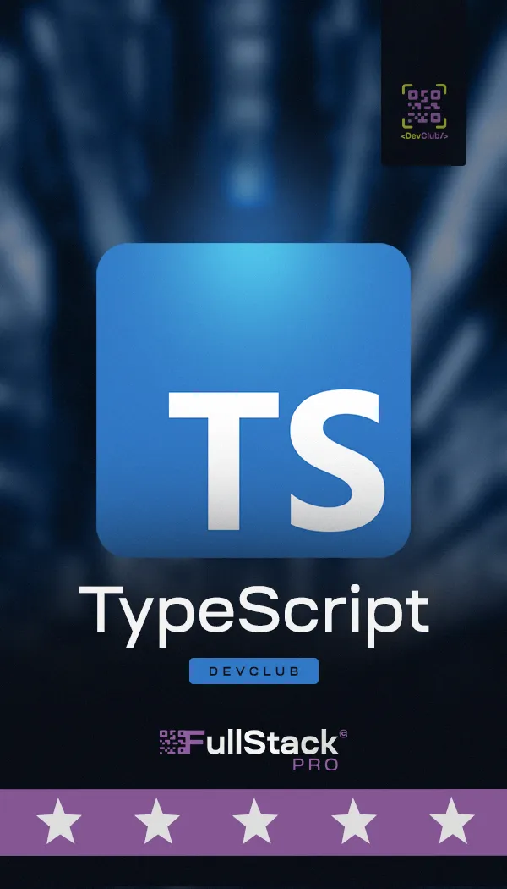
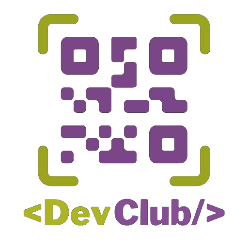

<!-- :man_technologist: Aprendendo Typescript -->

<!-- 
    Aprendendo Typescript - DevClub

    Instalar o Node

    $ npm init -y
    $ npm install -D typescript

    Tranforme o arquivo ts em js
    $ npx tsc --init
    $ npx tsc

    Agora vamos rodar o código "direto" do typescript
    $ npm install -D tsx

    $ npx tsx "nome-do-arquivo.ts"
    
-->

## Aprendendo Typescript - DevClub

   

## Sobre o Projeto

Essa aplicação backend faz parte do projeto final do curso MBA FullStak do DevClub.

A aplicação tem foco no mercado e, assim, foi desenvolvida utilizando uma variedade de tecnologias modernas para criar uma experiência robusta e escalável. Abaixo estão as principais tecnologias utilizadas:

Node.js: Plataforma de execução de JavaScript para servidor.
  Express.js: Framework web para Node.js que facilita a criação de APIs.
  PostgreSQL: Banco de dados relacional para armazenamento estruturado de dados.
  MongoDB: Banco de dados não-relacional para armazenamento flexível de dados.
  MVC (Model-View-Controller): Padrão de arquitetura para separar a lógica de negócios da interface do usuário.
  Docker: Plataforma de contêineres para facilitar a implantação e o gerenciamento de aplicativos.
  Bcrypt e Yup: Bibliotecas para validação e criptografia de dados sensíveis, como senhas.
  Sequelize: ORM (Object-Relational Mapping) para facilitar a interação com o banco de dados PostgreSQL.
  JWT (JSON Web Tokens): Mecanismo para autenticação e troca segura de informações entre partes.
Eslint e Prettier: Ferramentas para garantir a consistência e a qualidade do código JavaScript.

## Tecnologias Utilizadas

## Sobre o Curso

A Formação Devclub é a formação mais completa de programação que você já viu, uma vez que você aprende do zero ao avançado para em menos de 06 meses estar atuando como um programador full stack.

A Formação possui mais de 35 módulos e entre eles aulas completas de HTML, CSS, Javascript, Node, Banco de dados, React e muito mais!

Sem contar com as aulas liberadas constantemente como potencializador do seu aprendizado.

 

## Sobre o Professor

Sou um desenvolvedor de software com mais de 6 anos de experiência na criação de produtos digitais e serviços inovadores. Tenho uma paixão por buscar ambientes que me proporcionem o desenvolvimento contínuo de minhas habilidades técnicas e de liderança, enquanto também contribuo para o crescimento e aprimoramento das pessoas ao meu redor.

Minha motivação é fazer parte da construção de aplicações que não apenas atendam às necessidades do mercado, mas que também tenham um impacto positivo e significativo na vida das pessoas. Sou um entusiasta da colaboração interdisciplinar, acreditando que as melhores soluções surgem quando diferentes áreas se unem para enfrentar desafios complexos. Sou proativo por natureza e sempre busco maneiras de inovar e aprimorar processos, garantindo que nosso trabalho esteja sempre na vanguarda da tecnologia.

Meu compromisso com a excelência é evidente em minha busca constante pelo aprendizado. Estou sempre atualizado com as mais recentes tecnologias, ferramentas e tendências de arquitetura de software. Além disso, estou constantemente explorando como aplicar esse conhecimento em meu dia a dia, a fim de criar soluções mais eficientes e eficazes.

Estou ansioso para fazer parte de equipes inspiradoras e projetos desafiadores, onde posso contribuir com minha experiência e paixão pela tecnologia, ajudando a moldar um futuro digital mais promissor e impactante para todos.

GitHub: https://github.com/agustinhopneto

<a href="https://www.linkedin.com/in/agustinhopneto/" target="_blank"> 
 Agustinho P Neto 
 </a>

## Sobre o Aluno

🎓 Análise de Sistemas - Cruzeiro do Sul  
💻 Estudante FullStack: DevClub  
👩🏻‍💻 Autor do Site: <a href="https://igorlazzaretti.com/">igorlazzaretti.com</a>  
📚 Leitor e Estudante de Inglês  
🧙‍♂️ Fã de Harry Potter   

##

> "Acredite nos seus sonhos"   - Igor Dossin Lazzaretti

<!-- ICONES

https://devicon.dev/

 -->